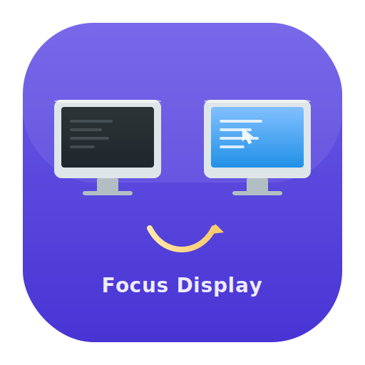

<p align="center">
  
</p>

# focus_other_display

A macOS tool that switches focus to the frontmost window on the other display in a dual-display setup.

## Requirements

- macOS
- Rust (nightly) — uses edition 2024
- A dual-display setup

### macOS permissions

- **Accessibility** (System Settings > Privacy & Security > Accessibility) — required to manipulate windows
- **Screen Recording** (same > Screen & System Audio Recording) — used to read window titles (the tool works without it)

## Build & run

```sh
cargo build --release
./target/release/focus_other_display
```

## Usage

```sh
./focus_other_display          # toggle to the opposite display
./focus_other_display first    # to the main display (the one with the menu bar)
./focus_other_display second   # to the secondary display
```

`first` / `second` do not depend on the physical arrangement (left/right, top/bottom) of the displays.

With or without an argument, the focus target is always the topmost window on the target display, regardless of app. `first` / `second` work independently of where keyboard focus currently is, so they can be used even while you are looking at an empty desktop with no windows.

If the target display has no windows at all, the tool clicks the center of its desktop to focus the display itself: Ctrl+arrow Space switching and newly opened windows will then target that display.

Run with `FOD_DEBUG=1` to print diagnostics about window matching and focus confirmation to stderr.

## How it works

1. With no argument, determine which display the currently focused window (`AXFocusedWindow`) is on and target the opposite one (falling back to CGWindowList, then to the mouse position; with an explicit `first`/`second`, the target is that display regardless of the current location)
2. Find the topmost window on the target display (if there are no windows, click the center of the desktop to focus the display itself and exit)
3. Move the mouse cursor to the center of that window
4. Bring the window forward and make it the key window with `AXMain` + `AXRaise`, moving keyboard focus

```
OK: second(サブ) [WezTerm] → first(メイン) [Google Chrome - GitHub]
```

## Binding to a keyboard shortcut

To bind it to `Ctrl+Space` with [Hammerspoon](https://www.hammerspoon.org/):

```lua
hs.hotkey.bind({"ctrl"}, "space", function()
  hs.task.new("/path/to/focus_other_display", nil):start()
end)
```

## Project layout

```
src/
  main.rs            -- entry point, main logic
  appkit.rs          -- frontmost app lookup (NSWorkspace)
  display.rs         -- display info (CGDisplay)
  window.rs          -- window enumeration (CGWindowList)
  accessibility.rs   -- raising windows via AXMain/AXRaise, AXFocusedWindow lookup
  cursor.rs          -- mouse cursor movement and clicks (CGEvent)
```
